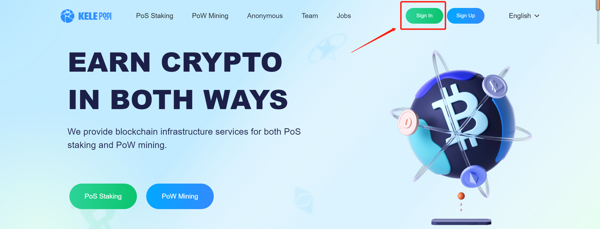

# Account registration and login

## **Register**&#x20;

Enter the official website of [KelePool](https://www.kelepool.com/), click "Sign Up", and fill in the email, password, and verification code as required to register.&#x20;

.png>)

## **Log in**&#x20;

* If you already have an account, click "Sign In" and enter your account and password to enter the website.&#x20;

.png>)

* Log in to the website using the MetaMask wallet.

.png>)
