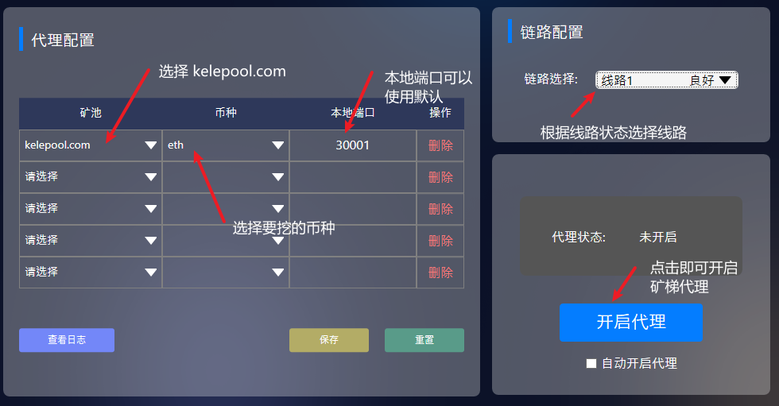

# 🪜 矿梯使用教程

## 1.注册及设置收款地址

1. 登录及设置收款地址流程参考[新手入门](../)

已邮箱登录：记录下子账户名称备用；

匿名/钱包挖矿：记录所用链上地址备用；

**网站地址（需VPN开全局代理）：** [**`https://www.kelepool.com/`**](https://www.kelepool.com/)

## 2.矿梯

注意事项

1.关闭系统的防火墙或者给防火墙添加矿梯程序，建议直接关闭防火墙。

2.在路由器中给矿梯所在电脑绑定静态IP。

3.使用矿梯时，不要同时开启VPN。

4.矿梯需要win10及以上的系统。

5.若电脑同时有无线网卡/有线网卡，在网络管理中禁用掉闲置未连通的网卡。

### a.矿梯下载

使用矿梯软件代理能让大陆用户的矿机隐藏踪迹、更加安全，同时提升挖矿算力，非常建议国内用户通过矿梯来连接矿机与矿池。

**矿梯官网：**[**https://kuangticcc.vip**](https://kuangticcc.vip)

.png>)

1.官网下载后解压，点击exe文件运行矿梯

.png>)

.png>)

### b.矿梯设置

1.矿池选择**kelepool.com**，币种选择**要挖的币种**，本地端口**默认**即可，点击**保存**完成设置

2.选择状态好的线路（如实际使用过程中延迟过高可以尝试切换线路），点击**开启代理。**

.png>)

3.使用矿梯过程中，如果矿机与矿池通信延时过高或观察者地址上矿机拒绝率过高，可以尝试切换其他线路。

4.使用矿梯连接挖矿软件，同时配置多种币种挖矿时，需用矿梯本地IP+本地端口代替直连时矿机配置中要求的矿池地址，因此需要注意端口数值的不同（以用户自己设备上的矿梯数值为准）

.png>)

### c.软件设置

矿梯开启代理成功后，需要修改矿机配置中的矿池地址为矿梯的代理地址，这里以BTC和ETC为例展示如何在矿机软件上设置矿梯参数，其他币种的设置同理。

#### **BTC矿机设置**

下面以蚂蚁矿机为例进行图示，

1. 矿机应与电脑置于同一网络
2. 通过矿机IP查找软件（如路由器管理软件或IP Report等）获取矿机IP
3. 登录电脑浏览器输入矿机IP，输入用户名密码
4. 在“Miner Configuration”**中选择**“Pool”**，再选择**“URL”**，输入**矿梯地址+端口，以矿梯设置的图示为例，则应输入：**stratum+tcp://192.168.0.234:30001（每个客户端的参数不同，以自己机器上显示的为准**
5. Worker填写模式为：可乐矿池里的子账号/用户名.编号，子账户/用户名即“矿池挖矿-切换账户”中显示的挖矿账户名，编号是区分矿机的编号，可按照自己需要自由编写，如有多台矿机，可以子账户名XXX为开头按XXX.01，XXX.02这个规律给机器编号方便管理。 然后点击应用就设置完毕了。
6. 如果是匿名挖矿/钱包地址挖矿，则子账户/用户名部分替换为所使用的链上地址即可，但需要注意不是所有矿机都支持使用地址。

.png>)

.png>)

#### **ETC矿机设置**

以开源矿工为例

1. 打开软件，选择主币为**ETC**，内核按照实际安装在矿机里的**内核软件**选择，主矿池选择**矿梯**，如选项中没有矿梯可以自己添加，**填好钱包**（如是邮箱注册用户这里填子账户名，匿名挖矿/钱包地址挖矿用户填写链上地址），**填好矿机名，**点击“尚未开始”就可以等待连接挖矿了。 其他类似软件大同小异，都是在矿梯设置好矿池币种开启代理的前提下，在软件中输入矿梯地址等信息连接挖矿
2. 需注意的是，和很多worker/矿工名需要填写“**矿池账户.矿机编号**”模式的软件不一样，开源矿工将两者分开，**钱包即矿池账号/用户名**，**矿机名则是矿机编号**。

.png>)

3.如需手动添加矿梯地址，则选择**主矿池**，点击**添加**，填写矿池名称为**矿梯，矿池地址为stratum+tcp://矿梯首页的本地IP+本地端口的模式，由于个人情况不一样，请以自己设备上显示的参数为准，图示仅供参考。**

.png>)

.png>)

.png>)

### d.查看算力及收益

设置完成后，可以稍等一会儿，再通过以下方式确认矿梯和矿机是否连接成功正常工作：

1. 查看矿梯页面的“活动/授权机器数”是否与启动的矿机数量匹配
2. 查看挖矿软件的日志或活动面板，确认矿机正常工作且算力显示正常
3. 前往可乐矿池的总览页面查看活跃矿机数量和算力是否正常(实时算力1-2小时显示，24小时算力次日显示)，预估收益可能出现偏差，以第二天实际结算的收益为准。

